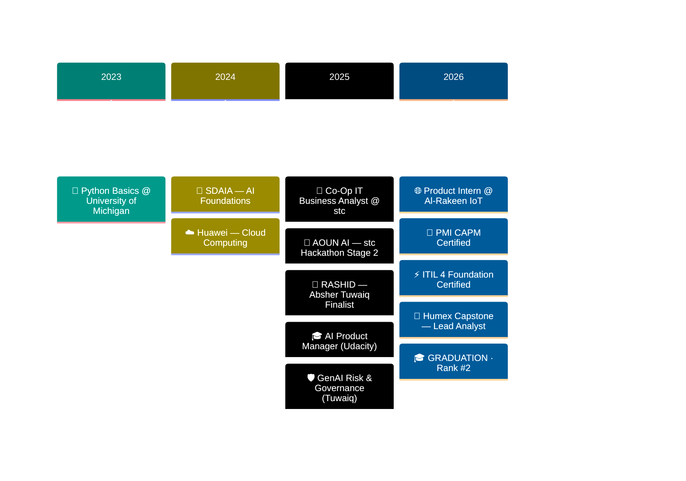

<!--
██████╗ ██████╗ ██████╗ ██╗   ██╗██╗     ███╗   ███╗ █████╗ ██╗     ███████╗██╗  ██╗
██╔══██╗██╔══██╗██╔══██╗██║   ██║██║     ████╗ ████║██╔══██╗██║     ██╔════╝██║ ██╔╝
███████║██████╔╝██║  ██║██║   ██║██║     ██╔████╔██║███████║██║     █████╗  █████╔╝
██╔══██║██╔══██╗██║  ██║██║   ██║██║     ██║╚██╔╝██║██╔══██║██║     ██╔══╝  ██╔═██╗
██║  ██║██████╔╝██████╔╝╚██████╔╝███████╗██║ ╚═╝ ██║██║  ██║███████╗███████╗██║  ██╗
╚═╝  ╚═╝╚═════╝ ╚═════╝  ╚═════╝ ╚══════╝╚═╝     ╚═╝╚═╝  ╚═╝╚══════╝╚══════╝╚═╝  ╚═╝

KONAMI CODE: ↑ ↑ ↓ ↓ ← → ← → B A
If you found this, you have the developer's eye. Email me — let's talk. 👁️
-->

<!-- ╔══════════════════════════════════════════════════════════════════════╗ -->
<!-- ║              🌌 CUSTOM SVG HERO — ANIMATED & GLOWING 🌌            ║ -->
<!-- ╚══════════════════════════════════════════════════════════════════════╝ -->

<div align="center">
  
</div>

<div align="center">
  
</div>

<div align="center">

[](#)
[](#)
[](#)
[](#)

[](#)
[](#)
[](#)

</div>

<br/>

<!-- ╔══════════════════════════════════════════════════════════════════════╗ -->
<!-- ║                      🎯 INTEL BRIEFING 🎯                            ║ -->
<!-- ╚══════════════════════════════════════════════════════════════════════╝ -->

<div align="center">

```diff
+ ╔══════════════════════════════════════════════════════════════════════════════╗
+ ║                    INTEL BRIEFING · CLASSIFIED · FOR-RECRUITERS-EYES-ONLY    ║
+ ╠══════════════════════════════════════════════════════════════════════════════╣
+ ║  SUBJECT:        Abdulmalek Alghamdi                                         ║
+ ║  AFFILIATIONS:   University of Hafr Al-Batin · Saudi Council of Engineers    ║
! ║  RANK:           2nd of Cohort · Computer Engineering · Class of 2026        ║
+ ║  PROVEN AT:      Channels by stc · Al-Rakeen IoT                             ║
+ ║  CERTIFIED BY:   PMI · PeopleCert · Udacity · SDAIA · Tuwaiq · Huawei        ║
+ ║  SPECIALTIES:    System Analysis · Generative AI · Computer Vision           ║
+ ║  COMBAT RECORD:  3 production projects · 2 hackathon advancements            ║
@@ ║  THREAT LEVEL:   ⚠ EXTREME — Will be off the market soon                   @@ ║
+ ║  ACTION:         Send transmission via LinkedIn or Email below               ║
+ ╚══════════════════════════════════════════════════════════════════════════════╝
```

</div>

---

<!-- ╔══════════════════════════════════════════════════════════════════════╗ -->
<!-- ║                  🧠 NEURAL PROFILE INTERFACE 🧠                      ║ -->
<!-- ╚══════════════════════════════════════════════════════════════════════╝ -->

## <samp>` ◆ ` &nbsp; **NEURAL_PROFILE.tsx** &nbsp; ` ◆ `</samp>

<table align="center" width="100%">
<tr>
<td width="58%" valign="top">

```typescript
// ═══════════════════════════════════════════════
//  Initializing engineer profile...
// ═══════════════════════════════════════════════

interface Engineer {
  identity: Identity;
  arsenal: Arsenal;
  mission: Mission;
  philosophy(): string;
}

const abdulmalek: Engineer = {
  identity: {
    name: "Abdulmalek Alghamdi",
    title: "System Architect × AI Engineer",
    classRank: 2,                      // top 2% of cohort
    affiliation: "Saudi Council of Engineers",
    membershipId: "#1009232",
    location: "Saudi Arabia 🇸🇦",
    languages: ["العربية", "English"],
  },

  arsenal: {
    code:    ["Java", "Python", "JavaScript", "SQL"],
    ai:      ["YOLOv8", "OpenCV", "GPT/LLM", "Pandas"],
    design:  ["UML", "BPMN", "SDLC", "Agile"],
    stack:   ["Spring Boot", "React", "Tailwind", "Streamlit"],
  },

  mission: {
    building: "Humex — AI Occupancy Engine (Capstone)",
    learning: ["Enterprise Architecture", "MLOps", "GenAI"],
    goal:     "Lead AI product engineering in MENA"
  },

  philosophy: () => "Translate chaos → clean systems. Ship.",
};

console.log(abdulmalek.philosophy());
// ► Translate chaos → clean systems. Ship.
```

</td>
<td width="42%" valign="top">

<div align="center">

### ⚡ <samp>COMBAT_STATS</samp>

</div>

```ansi
[38;5;51m╔═══════════════════════════════════╗[0m
[38;5;51m║[0m  [38;5;226mCLASS_RANK[0m       [38;5;196m#2 of cohort[0m   [38;5;51m║[0m
[38;5;51m║[0m  [38;5;226mINTERNSHIPS[0m      [38;5;46m2 (stc, Rakeen)[0m [38;5;51m║[0m
[38;5;51m║[0m  [38;5;226mHACKATHONS[0m       [38;5;46m2 advanced[0m      [38;5;51m║[0m
[38;5;51m║[0m  [38;5;226mCERTIFICATIONS[0m   [38;5;46m9+ stacked[0m      [38;5;51m║[0m
[38;5;51m║[0m  [38;5;226mPROJECTS[0m         [38;5;46m3 production[0m    [38;5;51m║[0m
[38;5;51m║[0m  [38;5;226mLANGUAGES[0m        [38;5;46mAR + EN[0m         [38;5;51m║[0m
[38;5;51m╚═══════════════════════════════════╝[0m

[38;5;226m> CALIBER     [0m [38;5;46m████████████░[0m [38;5;46m94%[0m
[38;5;226m> MOMENTUM    [0m [38;5;196m█████████████[0m [38;5;196mMAX[0m
[38;5;226m> AVAILABILITY[0m [38;5;46m🟢 READY TO START[0m
```

<br/>

<div align="center">

### 🎖️ <samp>SPECIAL_OPS</samp>

`Lead Analyst @ Humex` <br/>
`Co-Op Analyst @ stc` <br/>
`Product Intern @ Al-Rakeen` <br/>
`Hackathon Finalist × 2`

</div>

</td>
</tr>
</table>

---

<!-- ╔══════════════════════════════════════════════════════════════════════╗ -->
<!-- ║              🏗️ HOW MY BRAIN PROCESSES PROBLEMS 🏗️                   ║ -->
<!-- ╚══════════════════════════════════════════════════════════════════════╝ -->

## <samp>` ◆ ` &nbsp; **PROBLEM_PIPELINE.svg** &nbsp; ` ◆ `</samp>

<div align="center">
  
</div>

<details>
<summary><b>📖 &nbsp; Click to read the methodology</b></summary>

<br/>

> **Layer 01 — INPUT.** I refuse to start coding until I understand the chaos. Stakeholders, goals, constraints, pain points, domain — they all go in.
>
> **Layer 02 — ANALYSIS.** Decompose. Model. Validate. UML diagrams, BPMN flows, user stories with crisp acceptance criteria. Risks mapped. Sign-off secured.
>
> **Layer 03 — BUILD.** Spring Boot for the spine. React/Tailwind for the face. YOLOv8 + OpenCV when vision is needed. GPT when language is the medium. SQL/NoSQL for memory.
>
> **Layer 04 — OUTPUT.** Production. Measured. Iterated. The only artifact that matters.

</details>

---

<!-- ╔══════════════════════════════════════════════════════════════════════╗ -->
<!-- ║                      💼 BATTLE RECORD 💼                              ║ -->
<!-- ╚══════════════════════════════════════════════════════════════════════╝ -->

## <samp>` ◆ ` &nbsp; **BATTLE_RECORD.timeline** &nbsp; ` ◆ `</samp>



<table>
<tr>
<td width="50%" valign="top">

<div align="center">

### 🏢 `stc/channels`
**IT BUSINESS ANALYST** · Co-Op
*Riyadh · Jun 2025 — Dec 2025*

</div>

```yaml
mission: Digital channels transformation
deliverables:
  - business_requirements_documentation
  - user_stories & use_cases
  - process_flow_diagrams (BPMN)
  - stakeholder_alignment_workshops
breakthrough: AOUN AI → Stage 2 of stc Hackathon
toolkit: [Jira, Confluence, BPMN, SQL]
verdict: ⭐⭐⭐⭐⭐
```

</td>
<td width="50%" valign="top">

<div align="center">

### 🌐 `Al-Rakeen/IoT`
**PRODUCT DEVELOPMENT** · Intern
*Jan 2026 — Apr 2026*

</div>

```yaml
mission: IoT digital product lifecycle
deliverables:
  - functional_requirements
  - system_specifications
  - prototype_validation
  - cross_functional_collaboration
focus: Concept → Prototype pipeline
toolkit: [IoT, Agile, Postman, Jira]
verdict: ⭐⭐⭐⭐⭐
```

</td>
</tr>
</table>

---

<!-- ╔══════════════════════════════════════════════════════════════════════╗ -->
<!-- ║                     🚀 FLAGSHIP PROJECTS 🚀                          ║ -->
<!-- ╚══════════════════════════════════════════════════════════════════════╝ -->

## <samp>` ◆ ` &nbsp; **FLAGSHIP_PROJECTS.json** &nbsp; ` ◆ `</samp>

<!-- ━━━━━━━━━━━━━━━━━━━━━━━━━━━━━━━━━━━━━━━━━━━━━━━━━━━━━━━━━━━━━ -->

<table>
<tr>
<td>

### 🥇 <samp>[ PROJECT_001 ]</samp> &nbsp; HUMEX

<sub>**Real-Time AI Occupancy Engine** — Capstone 2026 · Lead System Analyst</sub>

[](#)
[](#)
[](#)

```bash
$ humex --explain
> Domain:       Facility management · Public safety · Crowd analytics
> Pipeline:     YOLOv8 → OpenCV → Real-time inference → Streamlit
> Frontend:     React dashboard with live occupancy metrics
> My ownership: Requirements · Architecture · ML Pipeline · Frontend
> Stack:        [Python, YOLOv8, OpenCV, React, Streamlit]
> Repository:   github.com/AbdulmalekAlghamdi/Humex-2026-Capstone-Project
```

[](https://github.com/AbdulmalekAlghamdi/Humex-2026-Capstone-Project)

</td>
</tr>
</table>

<!-- ━━━━━━━━━━━━━━━━━━━━━━━━━━━━━━━━━━━━━━━━━━━━━━━━━━━━━━━━━━━━━ -->

<table>
<tr>
<td>

### 🥈 <samp>[ PROJECT_002 ]</samp> &nbsp; RASHID

<sub>**GPT-Powered Smart Gate** — Absher Tuwaiq Hackathon · 🏆 Finalist</sub>

[](#)
[](#)
[](#)

```bash
$ rashid --pitch
> Problem:      Government access control = friction + slowness
> Solution:     GPT-powered intelligent gate with NLP authentication
> My ownership: Workflow analysis · Solution architecture · Pitch
> Outcome:      🏆 FINALIST at Absher Tuwaiq Hackathon
> Stack:        [OpenAI GPT, Python, IoT integration]
```

</td>
</tr>
</table>

<!-- ━━━━━━━━━━━━━━━━━━━━━━━━━━━━━━━━━━━━━━━━━━━━━━━━━━━━━━━━━━━━━ -->

<table>
<tr>
<td>

### 🥉 <samp>[ PROJECT_003 ]</samp> &nbsp; AOUN AI

<sub>**Intelligent Request Router** — stc Hackathon · Stage 2 Qualified</sub>

[](#)
[](#)
[](#)

```bash
$ aoun-ai --explain
> Problem:      Manual request triage = enterprise bottleneck
> Solution:     AI-driven triage, prioritization & smart routing
> My ownership: Business requirements · Use cases · System design
> Outcome:      🚀 Qualified for Stage 2 of stc Hackathon
> Stack:        [AI/ML, Spring Boot, React]
```

</td>
</tr>
</table>

---

<!-- ╔══════════════════════════════════════════════════════════════════════╗ -->
<!-- ║                  🛠️ HEXAGONAL TECH MATRIX 🛠️                        ║ -->
<!-- ╚══════════════════════════════════════════════════════════════════════╝ -->

## <samp>` ◆ ` &nbsp; **TECH_STACK.matrix** &nbsp; ` ◆ `</samp>

<div align="center">
  
</div>

<details>
<summary><b>🔍 &nbsp; Tools & secondary stack</b></summary>

<br/>

<div align="center">


<br/>


</div>

</details>

---

<!-- ╔══════════════════════════════════════════════════════════════════════╗ -->
<!-- ║                  🎯 SKILL RADAR · COMBAT VIEW 🎯                     ║ -->
<!-- ╚══════════════════════════════════════════════════════════════════════╝ -->

## <samp>` ◆ ` &nbsp; **SKILL_RADAR.combat** &nbsp; ` ◆ `</samp>

<div align="center">
  
</div>

---

<!-- ╔══════════════════════════════════════════════════════════════════════╗ -->
<!-- ║                  📊 LIVE METRICS DASHBOARD 📊                        ║ -->
<!-- ╚══════════════════════════════════════════════════════════════════════╝ -->

## <samp>` ◆ ` &nbsp; **LIVE_METRICS.dashboard** &nbsp; ` ◆ `</samp>

<div align="center">

  <!-- Snake animation -->
  <a href="https://github.com/AbdulmalekAlghamdi">
    
  </a>

  <br/>

  <!-- Stats cards -->
  <a href="https://github.com/AbdulmalekAlghamdi">
    
    
  </a>

  <br/>

  <a href="https://github.com/AbdulmalekAlghamdi">
    
  </a>

  <br/>

  <!-- Activity graph -->
  

  <!-- Trophy room -->
  <a href="https://github.com/AbdulmalekAlghamdi">
    
  </a>

</div>

---

<!-- ╔══════════════════════════════════════════════════════════════════════╗ -->
<!-- ║                  📜 CERTIFICATION VAULT — NFT-STYLE 📜               ║ -->
<!-- ╚══════════════════════════════════════════════════════════════════════╝ -->

## <samp>` ◆ ` &nbsp; **CERT_VAULT.achievements** &nbsp; ` ◆ `</samp>

<table>
<tr>
<td width="33%" align="center">

<sub>` 🔷 ACHIEVEMENT_001 `</sub>

### CAPM
**`Project Management Pro`**


`Valid: 2026 — 2029` <br/>
`Authority: Project Management Institute` <br/>
`Tier: 🟦 Professional`

</td>
<td width="33%" align="center">

<sub>` ⚡ ACHIEVEMENT_002 `</sub>

### ITIL 4
**`Service Mgmt Foundation`**


`Valid: 2026 — 2029` <br/>
`Authority: PeopleCert` <br/>
`Tier: 🟩 Foundation`

</td>
<td width="33%" align="center">

<sub>` 🤖 ACHIEVEMENT_003 `</sub>

### AI Product Mgr
**`Nanodegree`**


`Issued: October 2025` <br/>
`Authority: Udacity` <br/>
`Tier: 🟪 Specialized`

</td>
</tr>
<tr>
<td width="33%" align="center">

<sub>` ☕ ACHIEVEMENT_004 `</sub>

### Java Web Dev
**`Nanodegree`**


`Authority: Udacity` <br/>
`Specialty: Backend` <br/>
`Tier: 🟧 Technical`

</td>
<td width="33%" align="center">

<sub>` 🛡️ ACHIEVEMENT_005 `</sub>

### GenAI Risk
**`Governance`**


`Issued: 2025` <br/>
`Authority: Tuwaiq Academy` <br/>
`Tier: 🟥 Specialized`

</td>
<td width="33%" align="center">

<sub>` 🧠 ACHIEVEMENT_006 `</sub>

### AI Foundations
**`Specialist`**


`Issued: 2024` <br/>
`Authority: SDAIA` <br/>
`Tier: 🟩 National`

</td>
</tr>
<tr>
<td width="33%" align="center">

<sub>` ☁️ ACHIEVEMENT_007 `</sub>

### Cloud Computing
**`Foundations`**


`Issued: 2024` <br/>
`Authority: Huawei` <br/>
`Tier: 🟥 Vendor`

</td>
<td width="33%" align="center">

<sub>` 🌐 ACHIEVEMENT_008 `</sub>

### Digital Transform
**`Multi-Track`**


`Issued: 2026` <br/>
`Authority: IBMI` <br/>
`Tier: 🟦 Strategic`

</td>
<td width="33%" align="center">

<sub>` 📈 ACHIEVEMENT_009 `</sub>

### Product-Led Growth
**`Micro-Cert`**


`Issued: 2026` <br/>
`Authority: Product School` <br/>
`Tier: 🟥 Product`

</td>
</tr>
</table>

---

<!-- ╔══════════════════════════════════════════════════════════════════════╗ -->
<!-- ║                  💭 DAILY DEV WISDOM (auto-updates) 💭               ║ -->
<!-- ╚══════════════════════════════════════════════════════════════════════╝ -->

## <samp>` ◆ ` &nbsp; **DAILY_TRANSMISSION.quote** &nbsp; ` ◆ `</samp>

<div align="center">

> *"The function of good software is to make the complex appear to be simple."*
>
> — **Grady Booch**

<br/>

<a href="https://github.com/AbdulmalekAlghamdi">
  
</a>

</div>

---

<!-- ╔══════════════════════════════════════════════════════════════════════╗ -->
<!-- ║                  📡 OPEN A TRANSMISSION 📡                            ║ -->
<!-- ╚══════════════════════════════════════════════════════════════════════╝ -->

## <samp>` ◆ ` &nbsp; **TRANSMISSION_PROTOCOL.connect** &nbsp; ` ◆ `</samp>

<div align="center">

```diff
+ ┌─────────────────────────────────────────────────────────────────────┐
+ │  STATUS:    🟢 ONLINE · Accepting full-time offers & collaborations │
+ │  RESPONSE:  ⚡ Within 24 hours                                       │
+ │  TIMEZONE:  🇸🇦 Riyadh / KSA (UTC+3)                                │
+ │  LANGUAGES: العربية (native) · English (professional)               │
+ │  CHANNELS:  Pick your preferred frequency below ↓                   │
+ └─────────────────────────────────────────────────────────────────────┘
```

<br/>

<a href="https://linkedin.com/in/abdulmalek-alghamdi-csegr">
  
</a>
<a href="mailto:Abdulmalek.Alghamdi@outlook.com">
  
</a>
<a href="https://github.com/AbdulmalekAlghamdi">
  
</a>
<a href="https://wa.me/966568728387">
  
</a>

</div>

---

<!-- ╔══════════════════════════════════════════════════════════════════════╗ -->
<!-- ║                       🌌 END OF TRANSMISSION 🌌                       ║ -->
<!-- ╚══════════════════════════════════════════════════════════════════════╝ -->

<div align="center">


<sub>

` ◆ ` `BUILT WITH DISCIPLINE IN SAUDI ARABIA` ` ◆ ` `2026` ` ◆ ` `THE BEST IS YET TO SHIP` ` ◆ `

</sub>

<br/>

```ansi
[38;5;51m> echo "If you read this far, we should talk." | sudo hire-me --priority=high[0m
```

<br/>

<sub>🥚 <i>Easter egg: this README has a Konami code. Try the developer's view 👀</i></sub>

</div>
